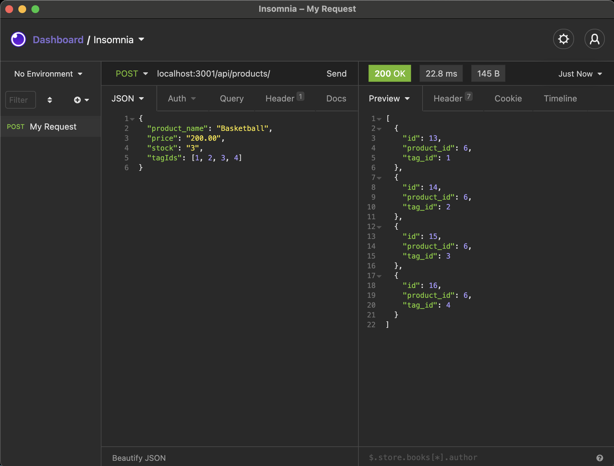
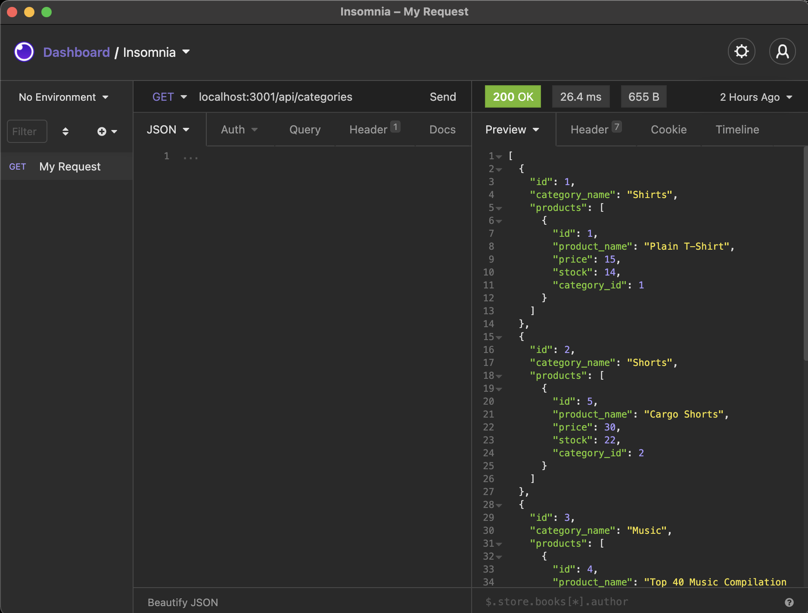

# e-commerce-back-end
## Description
Given e-commerce's prodominance in the electronics industry, generating an estimated $29 trillion in 2019, proficient and capable back-end development is crucial to market success. This back-end application lays the ground work for a powerful full stack online retail application.

## Table of Contents
- [Description](#Description)
- [Deployment](#Deployment)
- [Features](#Features)
- [Credits](#Credits)
- [Contributing](#Contributing)
- [License](#License)
  

## Deployment
- [GitHub Repo](https://github.com/jareddeuriarte/e-commerce-back-end)
  

### Features
- Full CRUD Operations
- Node.js techonology
- MySql & Sequelize technology
 

### Credits  
My tutor Namita.

### Contributing
Forks are welcome!

### License 
This project is licensed under MIT.

### Badges

  
### Questions?
Reach me at:
- [GitHub](https://github.com/jareddeuriarte)
- deuriartejared@gmail.com